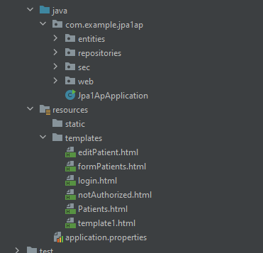
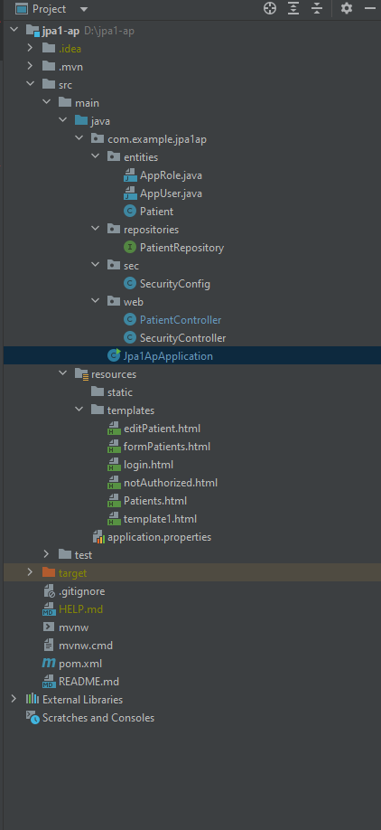
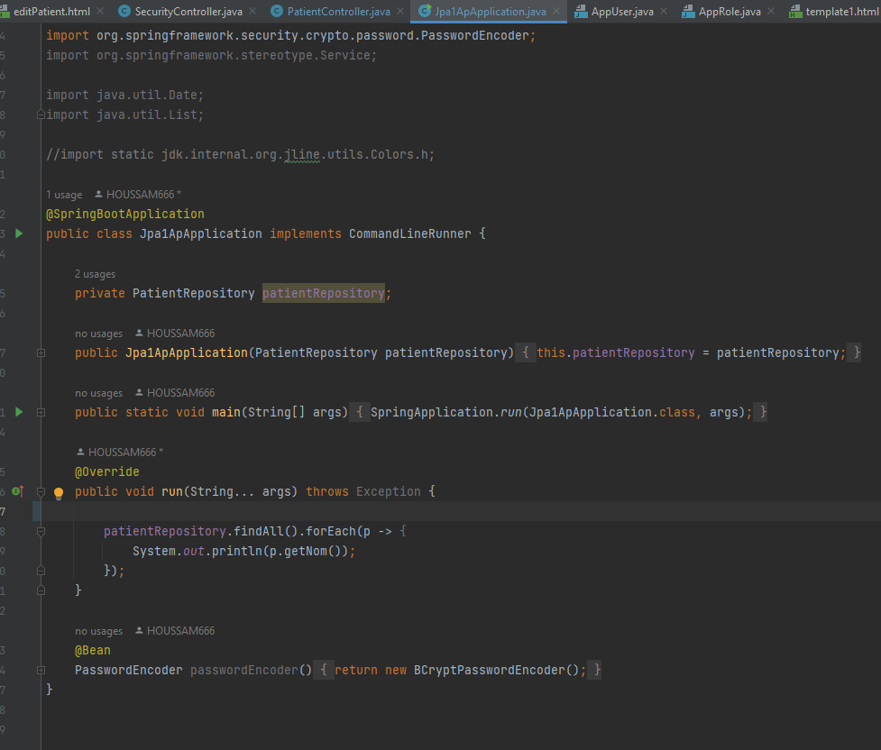
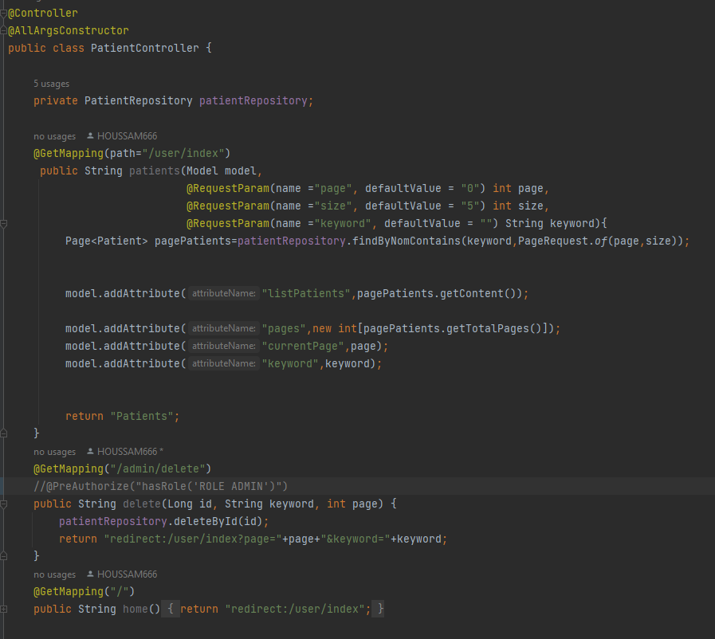
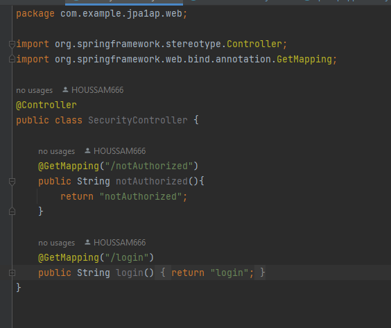
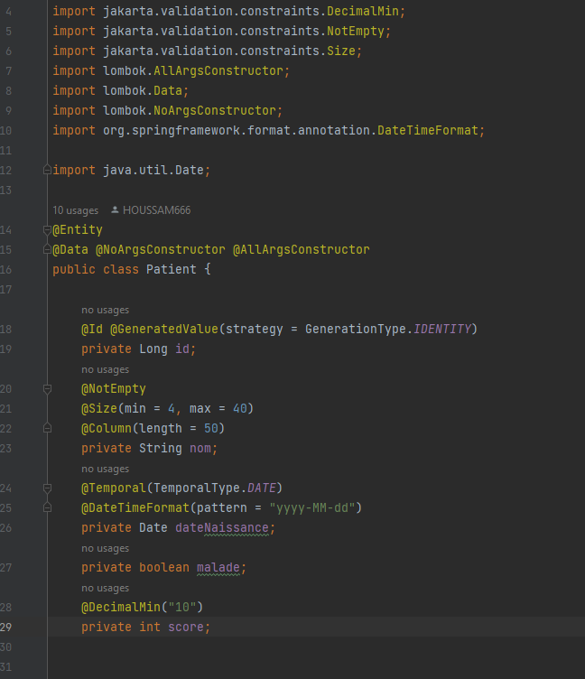
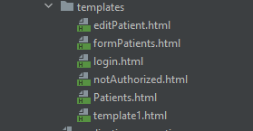

# Hospital-JEE
<H1>Rapport de projet</H1>

<H2>Introduction:</H2>

On a créer une application Web JEE basée sur Spring MVC, Thylemeaf et Spring Data JPA qui permet de gérer les patients.
Notre application nous permet d'Afficher les patients - Faire la pagination - Chercher les patients - Supprimer un patient.

<H2>Partie Code:</H2>

<H3>Structure du code:</H3>

<H3>Structure détaillé du code:</H3>

<H3>Notre application</H3>

<H3>PARTIE WEB: </H3>

<H4>Patient:</H4>

<H4>Security:</H4>

<H3>Class Patient</H3>

 L'entité possède plusieurs propriétés telles que "id", "nom", "dateNaissance", "malade" et "score".
 
@Entity : Cette annotation spécifie que la classe est une entité et doit être gérée par JPA.  
@Data : Cette annotation génère des getters et des setters pour les propriétés de la classe.  
@NoArgsConstructor : Cette annotation génère un constructeur sans arguments.  
@AllArgsConstructor : Cette annotation génère un constructeur avec tous les arguments.   
@Id : Cette annotation spécifie que le champ est la clé primaire de l'entité.  
@GeneratedValue : Cette annotation spécifie comment la clé primaire est générée.  
@NotEmpty : Cette annotation spécifie que le champ ne doit pas être vide.  
@Size : Cette annotation spécifie les contraintes de taille sur le champ.  
@Column : Cette annotation spécifie la définition de colonne pour le champ.  
@Temporal : Cette annotation spécifie le type temporel pour le champ de date.  
@DateTimeFormat : Cette annotation spécifie le format pour le champ de date.  
@DecimalMin : Cette annotation spécifie la valeur minimale pour le champ de score.  

<H3>Templates:</H3>

<H2>Login</H2>

La page contient un formulaire avec deux champs : "username" pour le nom d'utilisateur et "password" pour le mot de passe. Un bouton "Login" permet de soumettre le formulaire.

Il y a également une case à cocher pour se souvenir de l'utilisateur et un lien vers une page de récupération de mot de passe.

Le code inclut également des liens vers des fichiers CSS et JavaScript du framework Bootstrap pour le style de la page.

 
